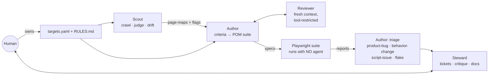

# testah

**AI agents author and maintain your test operation. The tests themselves run
with zero AI.**

testah is a multi-agent QA loop: agents map a target webapp into versioned
page-maps, turn those maps into acceptance criteria and a Page-Object-Model
Playwright suite, triage every failure, and draft the right tickets — while a
human approves every consequential step. The suite it produces is plain
`npx playwright test`: deterministic, CI-friendly, no LLM at runtime.

## How it works



| Role | What it does |
|---|---|
| **Scout** | Crawls designated pages (Crawl4AI), judge-passes them live in a browser (feature inventory, console health, Core Web Vitals), detects drift by content hash, flags observed defects |
| **Author** | Writes Given/When/Then acceptance criteria (human approves before any test is generated), builds/repairs the POM suite per `RULES.md`, triages every run |
| **Reviewer** | Independent fresh-context checkpoint on every test batch — fidelity, craft, and *teeth* (would this test fail if the feature broke?) |
| **Steward** | Validates Scout flags, drafts tickets, critiques the loop itself, owns the docs, bridges to the human |

The repo is the message bus: every hand-off is a committed, schema'd artifact
(page-maps, `changed-pages.json`, requirements, triage docs, ticket drafts),
so any stage can be re-run and git history is the audit log.

## What's in the box

- **One-command onboarding** — `bash setup.sh`: git remote, dependencies,
  first target, optional Linear hookup, command menu. Skippable, re-runnable.
- **Living page-maps** with drift detection — selector/structure changes
  count as drift, not just visible text.
- **Human gates with real enforcement** — criteria carry `approved:`
  frontmatter; every criteria file ends with an explicit *Judgment calls*
  section listing the product decisions your approval endorses.
- **Four-way triage** — `product-bug`, `behavior-change` (plausibly
  intentional divergence: agent recommends, human decides, criteria are never
  silently updated), `script-issue`, `flake` (3-of-last-10 threshold,
  per-browser-project ids, idempotent per run).
- **Interactive coverage maps** — self-contained HTML per target (pan, zoom,
  pinch): every feature card shows the actual tests implementing it and its
  last-run status; plus a flat markdown twin GitHub renders.
- **Local-first tickets** — `tickets/drafts/` is a fully functional queue
  with no tracker connected; one CLI drains it to Linear (tracker-agnostic
  by design — only the filing step knows the tracker exists).
- **A committed agent harness** — on Claude Code: `/scout`, `/author`,
  `/triage`, `/steward`, `/loop-status`; a tool-restricted Reviewer agent
  type; permission ask-gates on the human-owned law files; a post-edit
  pytest tripwire. Other LLM harnesses use `agents/*.md` directly.
- **Tested substrate** — the deterministic core (crawler, drift, flake
  tracker, coverage maps, ticket filer) is plain Python with a fast pytest
  suite; CI runs it alongside the e2e suite on every push.

## Quickstart

```bash
git clone --branch template --single-branch <this-repo> my-qa && cd my-qa
bash setup.sh
```

One command, a few questions: connect a git remote (GitHub/GitLab/Bitbucket),
install dependencies, point testah at your site, optionally connect Linear —
then it prints the command menu. The `template` branch is the clean starter;
`master` carries this repo's own working artifacts.

- **Design:** [docs/spec.md](docs/spec.md)
- **How to run each pass:** [docs/running-the-loop.md](docs/running-the-loop.md)
- **Agents:** [agents/](agents/) — Scout · Author · Reviewer · Steward (+ Gauge, phase 2)
- **Run the suite (no agents needed):** `pnpm exec playwright test`
- **Human-owned config:** [targets.yaml](targets.yaml) (what to map), [RULES.md](RULES.md) (how to test)

## Validated: the first full loop (v1)

Run end-to-end against a live SaaS staging environment:

- Scout mapped the designated public pages and — before a single test
  existed — surfaced real defects: a Cumulative Layout Shift of 0.28
  ("poor" band; the content grid reflows after first paint), dead-end
  navigation for logged-out visitors, mobile-drawer accessibility gaps
  (no Escape-close, no scroll lock, no `aria-expanded`), and site-wide
  missing-icon 404s. Each became a reviewable ticket draft.
- The Author generated 4 acceptance-criteria files, 4 page objects, and a
  33-execution Playwright suite; the independent Reviewer bounced the first
  batch (a vacuous order assertion, two non-idempotent retries) before
  passing it. The suite runs green against the live environment in ~45s
  with no agent involved.
- A deliberately planted failing test was triaged correctly as a
  script-issue — with a live replay proving the site healthy — rather than
  filed as a fake product bug. The triage path works because it was made to
  prove itself.

## Status and scope

v1 is **production-ready for its designed mode**: supervised, single-target,
human-gated QA operation. It is deliberately *not* an autonomous tester —
every criteria set, ticket, and merge passes a human. On the roadmap:
per-target Playwright projects for multi-site suites, authenticated-role
coverage (storageState/RBAC scaffolding exists, unexercised), a k6 load-test
agent (**Gauge**), a benchmark-run gate mode, judgment-pass cost caps, and a
unified dashboard over reports/coverage/benchmarks.

**Stack:** Playwright (TypeScript) · Python 3.12 + uv (Crawl4AI,
BeautifulSoup, pytest) · GitHub Actions · Claude Code as reference agent
harness (harness-agnostic by contract) · Linear via MCP/API (tracker-agnostic
by contract).

## Connect your tools

testah is **project- and tracker-agnostic**: point `targets.yaml` at any
website/webapp (multiple targets side by side are supported) and configure
its top-level `tracker:` block for wherever approved tickets should be
filed. Ticket drafts are plain markdown in `tickets/drafts/` — only the
Steward's filing step touches a tracker, so any issue tracker can slot in.
The reference implementation is Linear via MCP (see `.mcp.json`; the first
session prompts an OAuth flow where you pick your workspace). Live-browser
work uses Chrome DevTools MCP (also in `.mcp.json`), with any
Playwright-capable browser MCP as a drop-in fallback.

**No tracker connected? Nothing breaks.** `tickets/drafts/` is a
fully-functional local ticket queue — agents draft into it, the human
approves in it. When a tracker comes online, drain the queue:
`uv run python -m scripts.file_tickets` (CLI-first; for Linear it uses
`LINEAR_API_KEY` from the environment or a gitignored `.env`). Filed drafts
get stamped `status: filed:<id>` in place.

## Running the agents on your LLM platform

The agents are plain markdown instruction files in `agents/` — there is no
testah-specific runtime. Any agentic harness that can (1) read/write files
and run shell commands, (2) drive a browser (an MCP or its own tooling), and
(3) spawn a fresh-context subagent for the Reviewer can run the loop: start
a session in this repo and give it one agent file as its instructions
(e.g. "Follow agents/scout.md for target <key>"). Claude Code is the
reference harness and ships committed config (`CLAUDE.md` + `.claude/`):
`/scout <target>`, `/author <target>`, `/triage <run-id>`, `/steward`, and
`/loop-status` replace pasting prose, the Reviewer is a tool-restricted
agent type, edits to the human-owned law files always prompt you, a
post-edit pytest tripwire guards `scripts/`, and `.mcp.json` wires Chrome
DevTools + Linear MCPs. But Cursor, Copilot CLI, Codex, Gemini CLI, or a
custom Agent-SDK program work the same way — the repo's committed artifacts
are the only interface between passes, and the Playwright suite itself runs
with no LLM at all.
