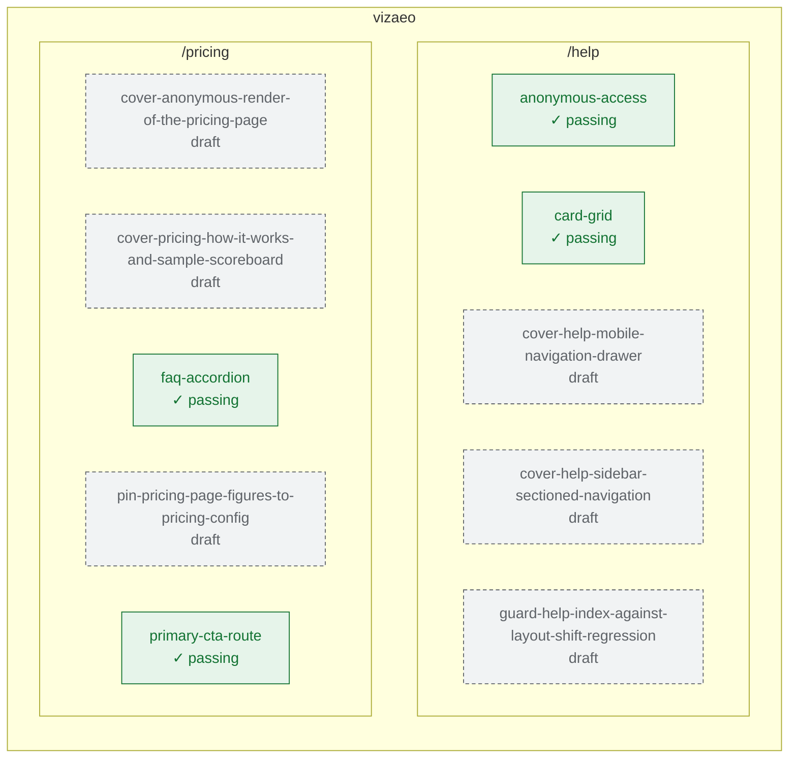

# Coverage map

> Generated by `uv run python -m scripts.coverage_map` — do not hand-edit.
> Colors: green = passing · red = failing · amber = flaky · blue = criteria without spec · dashed = ticket draft only.

## Status detail

| target | page | feature | stage | approved | last run | flake ≥ threshold |
|---|---|---|---|---|---|---|
| vizaeo | /help | anonymous-access | spec | unset | ✓ passing | — |
| vizaeo | /help | card-grid | spec | unset | ✓ passing | — |
| vizaeo | /help | cover-help-mobile-navigation-drawer | draft | draft | draft | — |
| vizaeo | /help | cover-help-sidebar-sectioned-navigation | draft | draft | draft | — |
| vizaeo | /help | guard-help-index-against-layout-shift-regression | draft | draft | draft | — |
| vizaeo | /pricing | cover-anonymous-render-of-the-pricing-page | draft | draft | draft | — |
| vizaeo | /pricing | cover-pricing-how-it-works-and-sample-scoreboard | draft | draft | draft | — |
| vizaeo | /pricing | faq-accordion | spec | unset | ✓ passing | — |
| vizaeo | /pricing | pin-pricing-page-figures-to-pricing-config | draft | draft | draft | — |
| vizaeo | /pricing | primary-cta-route | spec | unset | ✓ passing | — |

## Scaffolding specs (no criteria by design)

- `seed-failure.spec.ts` — ✗ failing
- `smoke.spec.ts` — ✓ passing
