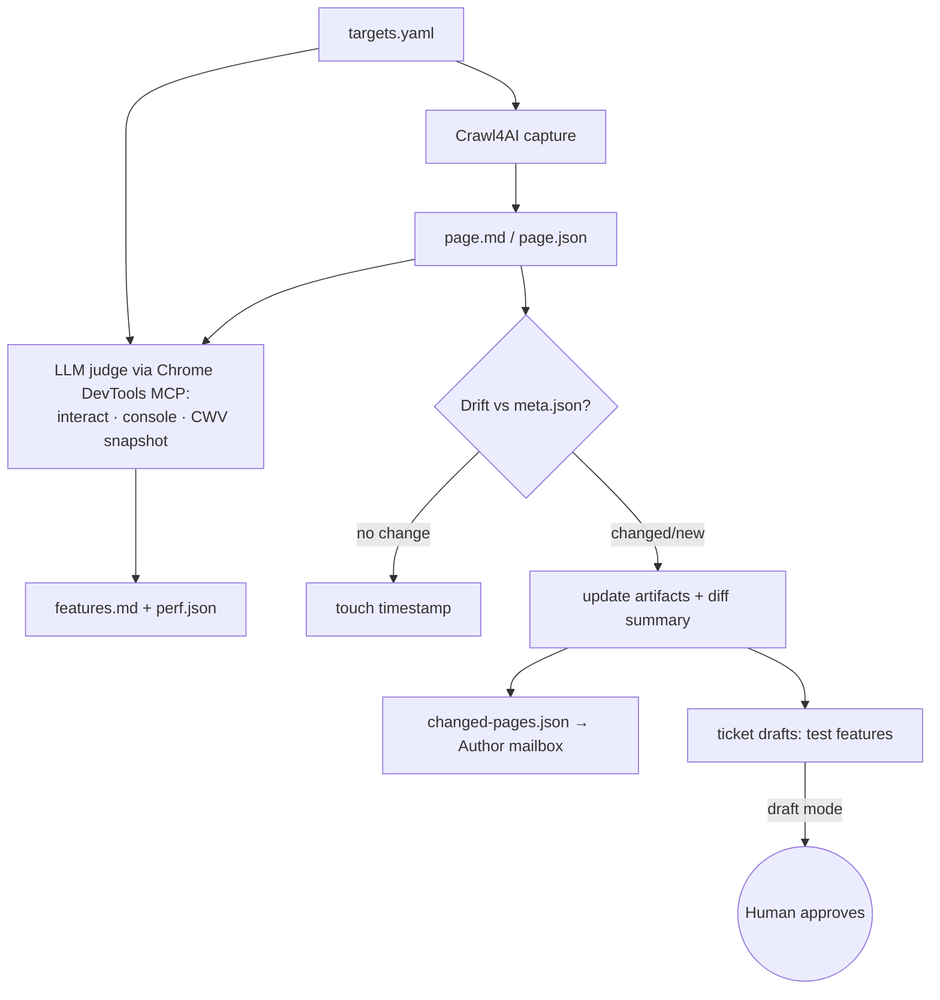
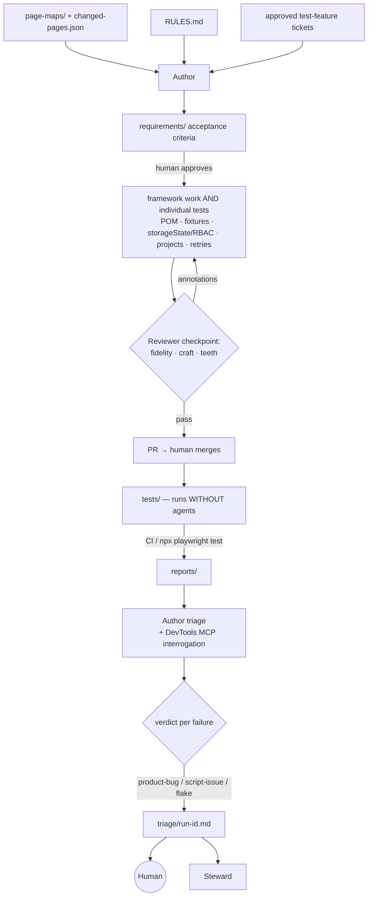
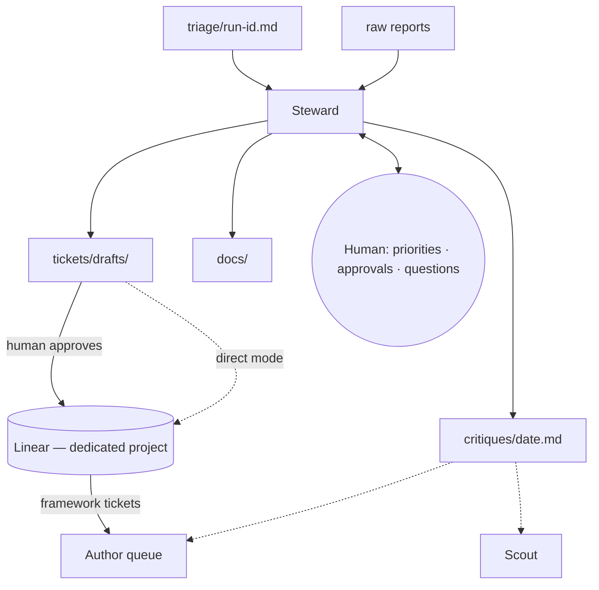
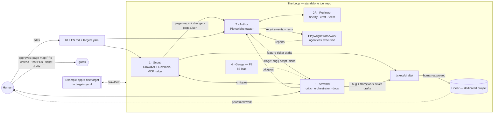

# testah — QA Testing Loop Agent Instruction File (v1.0)

> v1.0 (2026-08-31): declared production-ready for the designed mode —
> supervised, single-target, human-gated operation (see README "Status and
> scope" for the honest boundary + roadmap). One-command onboarding
> (`setup.sh`) shipped; README rewritten as the public face.
>
> v0.6.1 (2026-08-30): Claude Code harness formalized and committed —
> CLAUDE.md, `.claude/` (slash commands per pass, tool-restricted `reviewer`
> agent type, ask-gates on human-owned law files, pytest tripwire hook);
> synced to `template`. `agents/*.md` remains the harness-agnostic source of
> truth; all harness artifacts are pointers. See docs/running-the-loop.md
> "The Claude Code harness".
>
> v0.6 (2026-08-29): Scout files `product-bug` drafts for defects it
> directly observes (closes the "seen but never ticketed" gap); triage gains
> a **behavior-change** verdict (plausibly-intentional divergence → Author
> recommendation → human finalizes; criteria never silently updated);
> criteria files must end with a `## Judgment calls` section — the explicit
> list of product judgments the human's `approved: true` endorses;
> tracker-agnostic `tracker:` block in targets.yaml (Linear MCP = reference
> implementation only); coverage maps split per target. PROPOSED, not yet
> wired: "benchmark run" gate model (§ discussion in review) where criteria
> confirmation happens after the first run instead of before test
> generation.

> v0.5 (2026-08-29, post first full loop): criteria-approval gate is
> ALWAYS-ON (criteria carry `approved:` frontmatter; the human flips it);
> Author Mode B regenerates the living visual coverage map
> (`docs/coverage/<target>.html` — self-contained, pan/zoom, real tests per
> feature — plus a flat `<target>.md` for GitHub, both via
> `scripts/coverage_map.py`); `template` branch = shareable
> project-data-free starter (testah is project-agnostic and ships with a
> replaceable example target); tickets file through the configured tracker.
>
> Status of the v0.4 text below: built and validated 2026-08-28/29.
> v0.4: named **testah** (personal project); flake threshold 3 with
> triage-from-first-failure; model tiers (Opus-class judgment, Haiku
> human-facing); Scout on-demand, triage per CI run; agent names locked.
> v0.3: all tickets → dedicated Linear project (per-target `bug_destination`
> routing reserved as a later hookup); Scout auth policy (reuse storageState,
> else human authenticates the initial run).
> v0.2: standalone-repo decision, Chrome DevTools MCP tooling assignments
> (Author + Scout), Author writes individual tests (not just framework),
> Reviewer checkpoint in Author's pipeline, load testing spun out as phase-2
> Agent 4 (Gauge, k6), draft-first ticketing with direct-mode toggle.

## 1. Purpose

A multi-agent loop that keeps an always-current map of a target website/webapp,
turns that map (plus human-set project rules) into a deterministic Playwright
test suite, and closes the loop by triaging failures into product bugs vs
framework issues and drafting the right Linear tickets — with a human in the
loop at every consequential gate.

**Core principle: agents write and maintain the framework; the framework runs
without agents.** Test execution is plain `npx playwright test` in CI or
locally. Agents only re-enter the loop when pages drift, tests need to change,
or a run produces failures to triage.

## 2. Decisions log (resolved)

| Decision | Resolution |
|---|---|
| Home / name | **`testah`** — a standalone, project-agnostic repository. The first entry in `targets.yaml` is a replaceable testing ground, not the owner. |
| Harness (agent runtime) | v1: each agent is a Claude Code instruction file / skill in the tool repo — Scout fired on demand by the human, triage fired per CI run. Inter-agent "notification" is a committed artifact — the repo is the mailbox. A later port to the Claude Agent SDK is possible; the artifact contracts don't change. |
| Ticketing mode | **Draft-for-approval by default**; a per-target `ticketing: direct` toggle enables direct filing later. |
| Linear project | A **dedicated tracker project/team** for this tool. ALL tickets (feature, bug, framework) go there initially — including product bugs found in targets. The primary v1 goal is testing the tool itself with a replaceable proving-ground target. |
| Per-target tracker routing | **Later hookup, not v1.** `targets.yaml` reserves an optional `bug_destination` field per target (for example, route product bugs to the target team's tracker). Ticket drafts are written tracker-agnostic so this hookup is cheap when wanted. |
| Scout authentication | Reuse the suite's **storageState** files per role when they exist. When they don't (initial run / new target), the **human provides authentication** during that run (interactive login or supplied session); Scout never stores credentials in the repo. |
| Distributed systems | No bus/queues/services in v1. Versioned file artifacts in the repo are the message bus; git history is the event log. Contracts are queue-payload-shaped if we ever need real infrastructure. |
| Load testing | Separate phase-2 agent (**Gauge**, §8), same artifact pattern. Not folded into the Author. |
| Flake policy | Every failure is triaged and analyzed **from the first occurrence** — flake classification never suppresses analysis. Individual flakes are tracked, not ticketed; the same test flaky **3 times** (of the last 10 runs) auto-drafts a framework ticket. |
| Model tiers | **Judgment work** (Scout's judge pass, Author triage, Reviewer verdicts, Steward critiques) → **Opus-class (Opus 4.8)**. **Human-facing rendering** (summaries, docs formatting, ticket-draft bodies written from already-made judgments) → **Haiku**. No per-iteration cost cap set yet. |
| Scheduling | **Scout: on-demand** (human-fired, no cron). **Triage: per CI run** — every report gets analyzed as it lands. |
| Agent names | Locked: **Scout · Author · Reviewer · Steward · Gauge**. |

## 3. Tooling matrix — who uses what, and why

| Tool | Scout | Author | Reviewer | Steward | Gauge (P2) |
|---|---|---|---|---|---|
| **Crawl4AI** | primary: structured page capture (md/json) | — | — | — | — |
| **Chrome DevTools MCP** | judge layer: interactive feature discovery (modals, client-rendered state, console errors); CWV perf snapshots as a byproduct | triage interrogation (console/network/timing on live repro); selector validation before commit | spot-check that a test's flow matches the real page | optional: verify a repro before drafting a bug ticket | — |
| **Playwright** (framework, agentless) | — | authors it | reviews it | — | — |
| **k6** (or similar, agentless) | — | — | — | — | authors it |
| **Linear MCP** | drafts test-feature tickets | — | — | drafts bug/framework tickets; manages the project | — |

Why Chrome DevTools MCP earns its place: Crawl4AI extracts *content*; DevTools
MCP exposes *behavior and telemetry* (console, network, performance traces,
live interaction). The two biggest wins are (1) Author's triage — a JS
exception in the console or a 500 in the network log settles product-bug vs
script-issue far faster than trace archaeology, and (2) Scout's judge pass —
features hidden behind interaction (modals, accordions, client-side state)
that a crawl can never see.

## 4. Repository layout (the shared contract surface — tool repo root)

```
testah/
  agents/                   # instruction files: scout.md, author.md,
                            #   reviewer.md, steward.md, gauge.md (P2)
  RULES.md                  # human-owned: POM policy, test types, conventions
  targets.yaml              # per-target: designated pages/flows, base URLs per
                            #   env, auth roles, ticketing mode, bug-ticket
                            #   destination
  page-maps/<target>/<page-slug>/
      page.md               # clean structured Markdown of the DOM
      page.json             # structured JSON (elements, selectors, forms, nav)
      features.md           # LLM-judge description: purpose + feature
                            #   inventory incl. interaction-discovered features
      perf.json             # CWV snapshot from judge pass (byproduct)
      meta.json             # url, crawl timestamp, content hash, judge model
  changed-pages.json        # Scout → Author mailbox: pages that drifted
  requirements/<target>/<page-slug>/<feature>.md   # acceptance criteria
  tests/                    # the Playwright framework (agentless)
    pages/                  # Page Object Models
    fixtures/               # seed data, env setup/cleanup, auth, POM injection
    specs/
    playwright.config.ts    # projects, storageState, retries, parallelism
  reviews/<pr-or-batch>.md  # Reviewer output: annotated verdicts
  reports/                  # raw Playwright reports (JSON + HTML), per run
  triage/<run-id>.md        # failure → product-bug | script-issue | flake
  tickets/drafts/           # draft-mode ticket bodies awaiting human approval
  load/                     # (P2) k6 scripts, baselines, load reports
  docs/                     # Steward-owned framework documentation
  critiques/<date>.md       # Steward recommendations to agents & human
```

## 5. Agent 1 — Scout (explorer & cartographer)

**Mission:** keep `page-maps/` a faithful, current, structured representation
of every designated page.

1. Read `targets.yaml` for designated pages/flows (never free-crawl beyond it
   without human approval).
2. **Authenticate when the page requires it:** reuse the suite's storageState
   file for the relevant role if one exists; otherwise pause and ask the human
   to provide authentication for this run (interactive login or supplied
   session). Never persist credentials to the repo — only the resulting
   storageState files, per the framework's normal auth-setup project.
3. **Crawl4AI pass:** produce `page.md` + `page.json` (interactive elements,
   stable selectors, forms, navigation).
4. **LLM-judge pass (Chrome DevTools MCP):** open the live page, exercise
   interactions non-destructively (open modals, expand sections, tab through
   states), watch the console, and write `features.md` — what the page is for
   and every user-visible feature, including ones invisible to a static crawl.
   Record a Core Web Vitals snapshot to `perf.json` as a cheap byproduct
   (observation now; load *generation* is Gauge's job, phase 2).
5. **Drift detection:** hash/structural diff vs `meta.json`. Unchanged → touch
   timestamp. Changed → update artifacts, write a human-readable diff summary,
   and append to `changed-pages.json` (the Author's mailbox).
6. **Linear:** draft *test feature tickets* (one per new/materially changed
   feature) into `tickets/drafts/` — or file directly when the target's
   ticketing mode is `direct`. Always dedup against existing tickets first.



Guardrails: read-only against the target; never submits destructive forms
outside designated test environments; page-map updates land as a PR (human
reviews the diff summary, not raw DOM).

## 6. Agent 2 — Author (Playwright master & triage analyst)

**Mission:** own everything Playwright — at both altitudes: the framework
architecture *and* individual tests. Turn page-maps + `RULES.md` into
acceptance criteria and a best-practice deterministic suite; consume every
report and triage it.

### 6a. Authoring — framework AND single tests

The Author works at whichever altitude the change demands:

- **Framework level:** config, fixtures, POM architecture, projects, auth.
- **Individual test level:** one new feature → one new spec; one drifted
  selector → one POM repair. A single-page drift never triggers a framework
  pass.

Pipeline:

1. Inputs: `page-maps/`, `changed-pages.json`, `RULES.md` (POM policy, test
   types — e2e/API/contract/property/visual — naming, tagging),
   `targets.yaml` (roles/envs), approved test-feature tickets.
2. Write acceptance criteria to `requirements/` — Given/When/Then per feature.
   **Human approves criteria before tests are generated from them.**
3. Generate/maintain tests, enforcing Playwright best practice by default:
   - **storageState** per role for RBAC (auth once in a setup project; one
     project per role).
   - **Fixtures** for seed data, env setup/cleanup, POM injection, API clients.
   - **POM** per `RULES.md`; selectors sourced from `page.json`, validated
     against the live page via Chrome DevTools MCP before commit; pages that
     need `data-testid`s become recommendations routed to the Steward.
   - **Projects** for the browser/device matrix; **fullyParallel** + sharding;
     **retries** with a `flaky` tagging policy; web-first assertions, no hard
     sleeps, trace-on-retry.
4. Hand every batch to the **Reviewer checkpoint (§6b)** before opening a PR.

### 6b. Reviewer — checkpoint role inside the Author's pipeline

Not a fourth peer agent: a separate role (own instruction file, fresh context)
invoked on every Author batch before it reaches a PR. It exists because a
generator grading its own homework produces tests that pass without testing.

Reviews three things, writing verdicts to `reviews/`:

1. **Fidelity** — does each test actually verify its approved acceptance
   criterion (traceable 1:1)?
2. **Craft** — `RULES.md` + Playwright best practice: no hard sleeps, web-first
   assertions, proper fixture use, POM discipline, correct project placement.
3. **Teeth** — would this test fail if the feature broke? Flags vacuous
   assertions and tests that can't distinguish success from failure.

Reviewer annotates; Author fixes; only then does the PR open. The human still
reviews and merges — the Reviewer raises the floor, it does not replace the
human gate.

### 6c. Report consumption & triage

1. Tests run agentlessly (CI or `npx playwright test`) → JSON + HTML reports
   in `reports/`.
2. For each failure the Author interrogates, not just reads: replay the flow
   via Chrome DevTools MCP and inspect console (JS exception → product bug),
   network (API 4xx/5xx → product bug; request never fired → script/timing),
   and timing, alongside the Playwright trace. Classify:
   - **product-bug** — app behavior contradicts approved acceptance criteria.
   - **script-issue** — selector rot, race, bad fixture, wrong framework
     assumption.
   - **flake** — passed on retry / known-flaky pattern → still fully triaged
     and analyzed from the first occurrence, but tracked rather than ticketed
     individually. When the same test has been flaky 3 times in the last 10
     runs, the Author flags the threshold crossing in the triage doc and the
     Steward drafts the framework ticket.
3. Write `triage/<run-id>.md` (verdict + evidence + drift correlation with
   Scout's page-map history); serve raw report + analysis to both the human
   and the Steward.



## 7. Agent 3 — Steward (orchestrator, critic, human bridge, doc owner)

**Mission:** close the loop. Turn triage into the right tickets, critique the
process *and* the framework, route work between agents and the human, own the
documentation. Works **with** the human, never fully autonomously.

1. **Ticketing (draft-first):** consume `triage/<run-id>.md` →
   - product-bug → **product bug ticket** draft (repro from trace/DevTools
     evidence; expected behavior quoted from approved criteria).
   - script-issue → **framework update ticket** draft, routed to the Author's
     queue.
   - Drafts land in `tickets/drafts/` for one-click human approval; the
     per-target `ticketing: direct` toggle skips the draft step once trusted.
   - All tickets go to the **dedicated tracker project**, not a target's tracker.
     Dedup against open tickets; link recurring failures to existing tickets.
2. **Critic:** periodic review of the whole system — flake-rate trends,
   selector-rot hotspots, coverage gaps between `features.md` and
   `requirements/`, page-map staleness, ticket churn, Reviewer catch-rate.
   Writes `critiques/<date>.md` with concrete recommendations addressed to
   Scout, Author, Reviewer, or the human.
3. **Human bridge / orchestrator:** the single interface where the human sets
   priorities, approves gates, and asks "what's the state of the loop?".
   Batches questions instead of interrupting per-item.
4. **Documentation:** owns `docs/` — how the framework works, how to run it,
   triage playbook, conventions. Docs update in the same PR as any framework
   change.



## 8. Agent 4 — Gauge (load & performance, PHASE 2)

Deliberately separate: load testing is a different discipline (different tool,
different environment discipline, different signals, different cadence), and
folding it into the Author would muddy "master of all things Playwright."

- Authors and maintains **k6** (or similar) scripts in `load/` — same
  principle: agent writes, execution is agentless.
- Owns performance baselines; consumes Scout's `perf.json` CWV snapshots as
  leading indicators of where load scenarios matter.
- Runs only against explicitly designated environments in `targets.yaml`
  (never an environment it could hurt).
- Results flow through the same path: `triage/` verdicts (perf regression →
  product ticket; script artifact → framework ticket) → Steward → drafts.
- **Not built in v1.** Directory and contract reserved now so nothing needs
  restructuring later.

## 9. System interaction — the full loop



## 10. Loop cadence (one iteration)

1. **Scout pass** — re-crawl + judge targets, update page-maps, flag drift,
   draft feature tickets. *(on-demand, human-fired)*
2. **Human gate** — review page-map PR; approve/prioritize feature tickets.
3. **Author pass** — criteria for drifted/new features → human approves →
   generate/repair tests → **Reviewer checkpoint** → PR.
4. **Human gate** — review test PR, merge.
5. **Agentless run** — CI executes the suite → `reports/`.
6. **Triage pass** — runs per CI run: the Author interrogates every failure
   (DevTools MCP + traces) as each report lands, writes the triage doc.
7. **Steward pass** — ticket drafts, critiques, docs, summary to human.
8. Human approvals/priorities feed the next iteration.

## 11. Human-in-the-loop gates (explicit)

| Gate | Who | What |
|---|---|---|
| Page-map updates | Human | PR with drift summary |
| Acceptance criteria | Human | before test generation |
| Test framework changes | Reviewer (floor) → Human (merge) | PR |
| All Linear tickets | Human approves drafts (until `direct` toggle) | tickets/drafts/ |
| Critique adoption | Human | which recommendations become work |

## 12. Open questions

All design questions are resolved (see the decisions log, §2). Remaining
non-blocking item, to revisit once real usage data exists:

- **Cost cap** — no per-iteration budget cap is set for the Opus-class
  judgment passes. Revisit after the first few full loop iterations show
  actual spend.
